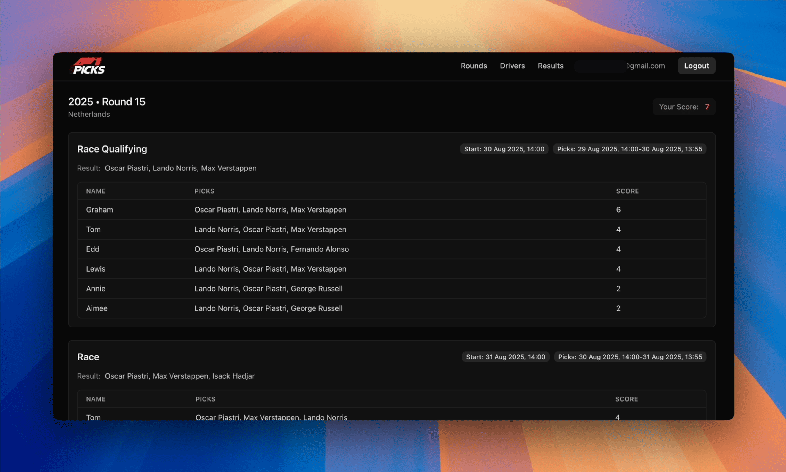

# 🏁 F1 Picks (2025 edition)

_4-hours to improve an F1 picks game, it's lights out and away we go!_ 🏎️ 💨

  
  

### Desktop

  
  

## Background

Last year, just before the 2024 Dutch Grand Prix, I put together a quick 4-hour sprint project: [F1 Picks](https://github.com/eddmann/f1-picks), a simple web-based game where my family could predict race outcomes.
The game was straightforward:

> Each player predicts the top three finishers in a Grand Prix.
> Scoring is awarded as follows:
>
> - 2 points for the correct driver in the correct position.
> - 1 point for the correct driver, wrong position.

It turned into a fun family tradition.
Despite some rough edges in the original build - both in aesthetics and workflow - we continued to play throughout that season and into the first half of this one.

However, since building the initial version, AI tooling has advanced significantly.
Integrated agentic workflows - such as Cursor and Claude Code - along with the introduction of MCP and models like GPT-5, have completely eliminated the need for my previous manual [code2prompt](https://github.com/mufeedvh/code2prompt)/ChatGPT routine 🎉.
With the launch of [Laravel Boost](https://boost.laravel.com/), I was also keen to explore how well it could enforce project-specific rules in a real-world scenario.

So, once again, I challenged myself: another **4-hour sprint before the [Dutch GP](https://www.formula1.com/en/racing/2025/netherlands) qualifying**. The goal?

- Spend some more time with Cursor and GPT-5.
- Give the site a F1 themed makeover.
- Improve the game's features and usability.
- Add meaningful test coverage to keep changes safe and predictable.

## Improvements

Here's what I achieved in this sprint:

- Dependencies
  - Upgraded to Laravel 12 and PHP 8.4.
  - Integrated Laravel Boost with tailored [project rules](./app/.ai/guidelines/project.blade.php), actively used by Cursor.
- Testing
  - Comprehensive test coverage now documents and verifies all key behaviours of the system.
  - This ensures ongoing stability and keeps LLM-driven changes consistently aligned with the intended behaviour.
- Styling
  - Replaced `new.css` with Tailwind CSS, introducing a F1-inspired theme and fully responsive design for both [mobile and desktop](./README).
  - Added a new F1 Picks logo generated with ChatGPT.
- Features
  - Defaults homepage to the current rounds paginated listing.
  - Ability to mark drivers as inactive/unavailable.
  - Auto-selects the current round for results entry.
  - Hides sprint option from results entry unless it's a sprint weekend.
